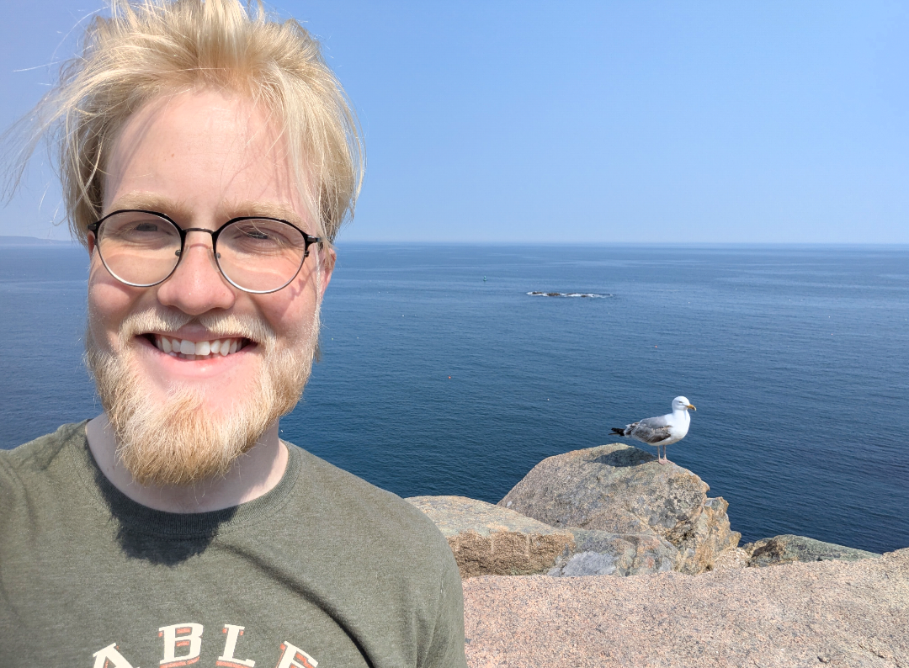
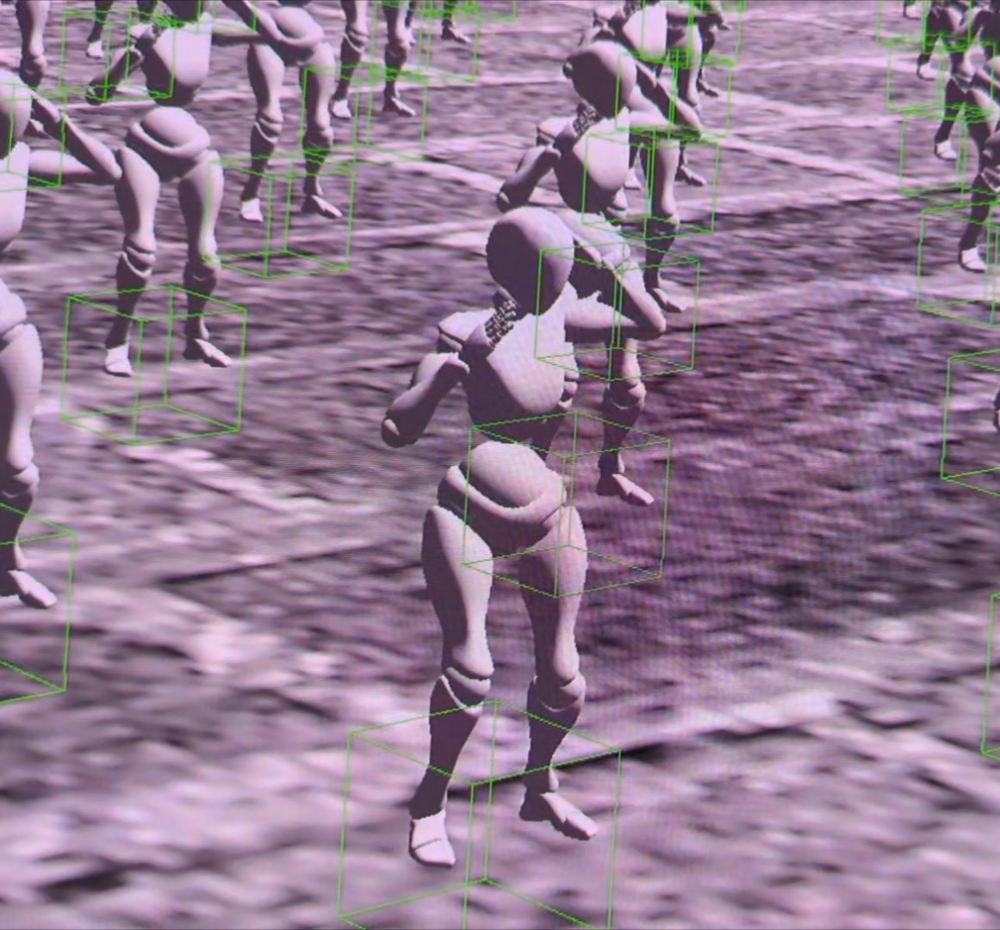
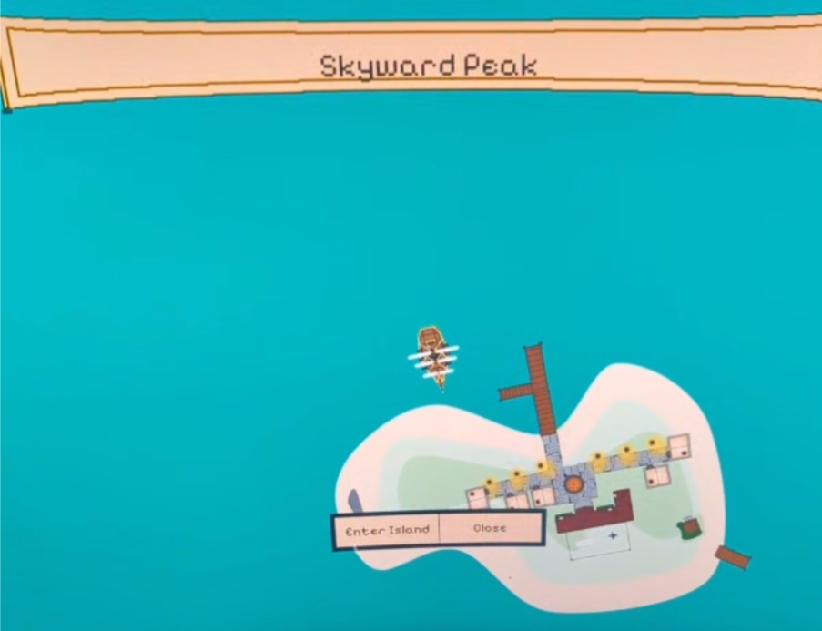

# Hi, I'm Scott (He/Him) 👋

## GitHub Stats
[]

<!-- NOT THE MOST FLATTERING GRAPH:
 -->

<!--FOR NICK- this feature didnt work for me, but it does what it implies.
## Top Languages
-->
## Languages:
- C++ (Primary)
- Python
- Scala
- GLSL
- SQL

## About Me: []
I am a Computer Science & Engineering student at the University of Iowa since 2025. I have been passionate about computers (particularly building, repair, and tech upcycling) since I was a kid. I began self-teaching C++ while I was in the Army during 2021. I went from there to studying Cyber Science & Operations at West Point for two years, before deciding to prioritize my career in 2024. In my spare time, I enjoy being around animals, playing strategy games, home networking, and learning how to fix just about anything- from my car to the kitchen sink. 

## My main projects:
## 1- GSEngine- A grounds-up simulation and game engine originally in OpenGL, now Vulkan. Originally a learning project.
[]
[]
### In particular, I worked on:
- OpenGL rendering pipeline, particularly shadows, reflections, and lighting shader files.
- Low-level mathematics and SIMD (Single Instruction, Multiple Data) integration and other parallelization.
- Collision detection and handling. Detection algorithms leverage Minkwoski Portal Refinement and the Separating Axis Theorem. Heavy emphasis on optimization.
- Physics integration, optimization, and adjustment to digital systems.
- Static reflection and type-protected physics quantities.
- Custom model, texture, and material library.
- Input handling.
- Network transfer optimizations.

## 2- PirateGame- A for-fun 2-D adventure game in SFML (Simple and Fast Multimedia Library).
[]
[]
### My focus areas:
- Multi-sprite object handling and synchronization.
- Player input handling.
- Combat systems and physics.
- AI combat and behavior.
- Entity registration and management.
- Quadtree mapping and 2-D optimization.
- Art and Resources!

